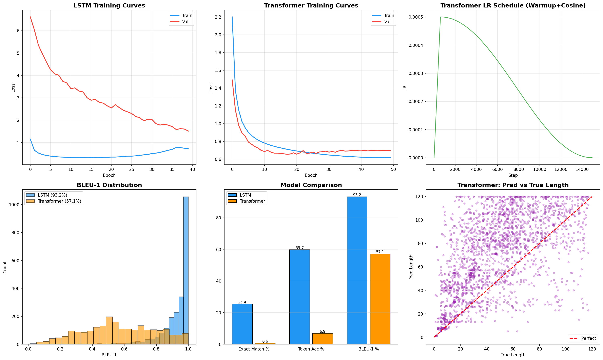

# FASEROH: Fast Accurate Symbolic Empirical Representation Of Histograms

**GSoC 2026 Evaluation Test — ML4Sci**

Seq2seq models that translate mathematical functions into their Taylor series expansions, framed as a neural machine translation problem.

## Problem

Given a mathematical function, predict its Taylor expansion up to 4th order:
```
sin(x)         →  x - x**3/6
exp(x)         →  1 + x + x**2/2 + x**3/6 + x**4/24
cos(2*x)       →  1 - 2*x**2 + 2*x**4/3
exp(3*x**2/4)  →  1 + 3*x**2/4 + 9*x**4/32
```

## Approach

### Task 1 — Data Generation & Tokenization
- **45K function–Taylor pairs** filtered from [Prosper's 57K symbolic-ai dataset](https://github.com/hbprosper/symbolic-ai), plus 19K additional pairs generated with SymPy across 8 difficulty levels
- **Math-aware tokenizer** that treats `sin`, `cos`, `exp`, `**` as single tokens (34-token vocabulary) instead of character-level tokenization used in prior work

### Task 2 — LSTM + Attention
- Bidirectional LSTM encoder with Bahdanau attention decoder
- Teacher forcing with linear decay (1.0 → 0.1 over 40 epochs)
- ReduceLROnPlateau scheduler
- 3.8M parameters

### Task 3 — Transformer
- Encoder-decoder Transformer with positional encoding
- Warmup + cosine annealing LR schedule
- 256 dim, 8 heads, 4 encoder/decoder layers, 1024 FFN
- 7.4M parameters

## Results

Trained on NVIDIA H100 NVL (100GB VRAM).

| Metric | Prosper Baseline | Our LSTM+Attention | Our Transformer |
|---|:---:|:---:|:---:|
| Architecture | Basic LSTM | BiLSTM + Attention | Transformer |
| Tokenization | Character-level | **Math-aware** | **Math-aware** |
| Training Data | 60,000 | 45,023 | 45,023 |
| Epochs | 3,890 | 40 | 50 |
| Best Val Loss | 2.35 | **1.51** | **0.65** |
| Exact Match % | N/A | **25.39%** | 0.63% |
| Token Accuracy % | N/A | **59.73%** | 6.89% |
| BLEU-1 % | N/A | **93.22%** | 57.11% |
| Parameters | N/A | 3,786,018 | 7,399,970 |
| LR Schedule | Constant | ReducePlateau | Warmup+Cosine |

### Key Findings

1. **Math-aware tokenization dramatically improves convergence.** Our LSTM reaches lower val loss in 40 epochs compared to 3,890 epochs with character-level tokenization — a 97x reduction in training time.

2. **LSTM+Attention outperforms Transformer on test-time accuracy** despite the Transformer achieving lower validation loss. This is due to the **exposure bias problem**: the Transformer is trained with full teacher forcing but must decode autoregressively at inference, causing error accumulation. The LSTM's teacher forcing decay schedule (1.0 → 0.1) trains it to handle its own mistakes.

3. **The LSTM achieves 25.4% exact match and 93.2% BLEU-1**, meaning it produces the correct Taylor expansion for 1 in 4 test functions, and even when wrong, the output is very close to the ground truth.



## Repository Structure
```
├── FASEROH_evaluation.ipynb     # Complete notebook (all 3 tasks)
├── h100_full_evaluation.png     # Training curves & comparison plots
├── data/
│   ├── prosper_60k.txt          # Prosper's 57K dataset
│   ├── data.txt                 # Filtered 45K training data
│   └── our_19k_data.csv         # SymPy-generated 19K dataset
├── models/
│   ├── best_lstm_h100.pth       # Trained LSTM weights
│   └── best_transformer_h100.pth # Trained Transformer weights
└── README.md
```

## Quick Start
```bash
pip install torch sympy numpy pandas matplotlib scikit-learn
jupyter notebook FASEROH_evaluation.ipynb
```

## Tech Stack

Python, PyTorch, SymPy, NumPy, Pandas, Matplotlib, scikit-learn

## Author

**Vishal Lohiya** — IIT Jodhpur, B.Tech Data Science & AI
- GitHub: [vishall4](https://github.com/vishall4)
- GSoC 2026 Contributor

## Acknowledgments

- [Harrison Prosper](https://github.com/hbprosper) (FSU) — FASEROH mentor, original symbolic-ai dataset
- [Abdulhakim Alnuqaydan](https://www.uky.edu/) (University of Kentucky) — FASEROH mentor
- [ML4Sci](https://ml4sci.org/) — GSoC umbrella organization

## License

MIT
